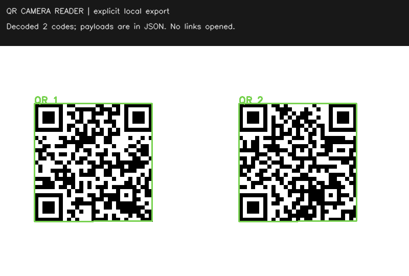

# QR Camera Reader



## What it does

Reads several QR codes in a local image or camera frame, draws their corners, and displays escaped text. Decoded links are never opened. Live frames, decoded payloads and session counters are not written to disk.

The session unique count deduplicates **complete payload strings**, not printed QR instances or people. Two codes with identical text are one unique payload. Memory is capped at 512 complete payloads; a CACHE FULL indicator means additional unique values are not counted. Per-frame results cap at 32; payloads longer than 2,048 characters are marked truncated and not counted as unique identities. Only the first four payload previews fit in the live header; that display cap is not the detection cap.

Read a local image explicitly:
```bash
.venv/bin/python app.py image "input/example.png"
```

The demo decodes two generated codes, including a deliberately non-routable `example.invalid` URL. It never opens a browser. Put a large, clear QR code in front of the camera; blur, glare, small codes and occlusion can prevent decoding. This is QR-only, not a universal barcode reader. The code does not determine whether a decoded link or message is trustworthy.

**Q/Esc** exits. **R** resets the in-memory session count.

## Run

Use this repository's directory for direct commands:

```bash
bash setup.sh
.venv/bin/python app.py demo
.venv/bin/python app.py camera
```

Setup creates a local `.venv` and installs the pinned OpenCV/NumPy dependencies. It does not modify another project or system Python. Standard CPython 3.11–3.14 is allowed by this setup; `PYTHON=python3.12 bash setup.sh` selects a version explicitly. Only one OpenCV provider is allowed in the environment. There is no MediaPipe dependency or model download.

From the parent camera-project kit, use `python3 portfolio.py setup qr-camera-reader`, `demo qr-camera-reader --open`, or `camera qr-camera-reader` instead. **Do not run the parent portfolio script from this subfolder.**

The live command opens local camera index 0; `--camera 1` selects another index. Close other camera applications first. macOS must permit camera access for your terminal/Python process. **Q/Esc** exits. The application loop always attempts to release the camera and close its windows, including on errors.

Demo and local-image commands explicitly write a PNG and JSON report under ignored `outputs/` by default. `--output some-new-name.png` selects a destination. Existing files or output symlinks are refused. Reports can contain private decoded/image-derived data: inspect them before sharing. The camera command does not write recordings or metrics. Package installation needs the package index; processing itself makes no network requests in this application code.

## Verify

```bash
.venv/bin/python -m unittest discover -s tests -v
```

22 tests passed on Linux CPython 3.13.5 with OpenCV 4.13.0 and NumPy 2.3.5. The tests include actual OpenCV processing of synthetic pixels, plus fake webcam/GUI calls for error-path coverage. macOS camera use and representative real-world precision/recall are **not verified** by those tests. See [validation](docs/VALIDATION.md), [design](docs/DESIGN.md), and [manual acceptance](docs/ACCEPTANCE_TESTS.md).

## References and license

The implementation uses the documented [OpenCV API](https://docs.opencv.org/4.13.0/de/dc3/classcv_1_1QRCodeDetector.html). Project code is MIT. Libraries keep their licenses; see [provenance](docs/PROVENANCE.md). This small demo is not a safety-critical detector or a certified measurement system.
